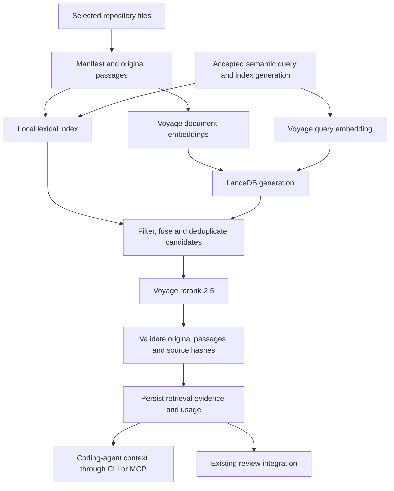

# Voyage retrieval implementation plan

Date: September 15, 2026.
Project: `attune-harness`.
Mode: executing the approved focused plan. Implementation began September 15, 2026.
See the [implementation receipt](voyage-retrieval-receipt.md) for completed checks
and pending live/platform qualification. The sections below retain the approved
delivery requirements; they are not a claim that every evaluation has passed.

## Outcome

Attune helps AI users create applications through vibe engineering: translating
their intent into working, tested code. The retrieval target is the application
being built, including its source, tests, interfaces, requirements, and selected
version-matched documentation.

Add an explicitly selectable Voyage retrieval backend that helps the coding
agent locate relevant implementation context, reranks it with `rerank-2.5`, and
supplies verifiable, replayable evidence. Retain a dependency-free core and the
existing local keyword backend. Harness's structured execution records remain
the basis for scope, state, and verification.

Representative tasks: find the existing authentication flow before adding a
login option; locate persistence code and tests when a user reports lost data;
find project conventions before implementing a new feature. These are proposed
evaluation examples, not claims about features in a particular application.

Patrick selected the standard Voyage option from the
[comparison and cost report](rag-options-research-2026-09-15.md): **$1.20 initial
indexing, $1.63/month at 1,000 searches, or $15.24/month at 10,000 searches** under
that report's workload assumptions. These are estimates, not spending limits or
a quote for the actual repositories.

**Done when:** an installed Harness wheel can build/update a selected local index,
retrieve original passages for coding agents through CLI/MCP and the existing
review integration, resume
without repeating completed provider work, and produce source and cost receipts.
Offline contract checks and a separately authorized live quality evaluation must
both pass before recommending the new backend for routine use. Product value is
measured on application changes and fixes, including independent acceptance
checks, rather than inferred from document-review accuracy alone.

## 1. Selected stack and proposed scope

| Layer | Implementation choice |
|---|---|
| Embeddings | `voyage-code-4` for semantic discovery in code and documentation initially. |
| Reranker | `rerank-2.5`, with provider truncation disabled. |
| Storage | LanceDB OSS, local persistent storage; one index writer. |
| Candidate search | Dense vector search plus local full-text/identifier search. |
| Fusion | Explicit reciprocal rank fusion, followed by the Voyage reranker. |
| Evidence | Original source passages with repository, revision, path, offsets, and hashes. |
| Packaging | Proposed optional `voyage` extra; pinned, qualified dependencies loaded lazily. |

LanceDB is the proposed database from the recommendation; the user selected the
Voyage/standard-reranker price row. One embedding model keeps the first delivery
aligned with its single-query-embedding assumption. Context embeddings, preview
rerankers, Qdrant, and additional providers remain later comparisons.

Proposed initial ingestion supports explicitly selected application repository roots,
Markdown sections, and Python functions/classes. Other explicitly allowed UTF-8
code formats can use bounded line passages labeled with that chunking method;
do not claim symbol-aware TypeScript/JavaScript parsing until qualified. Include
repository identifiers from the outset so identical paths in different repos
remain distinct.

Suggested starting settings: 1,024-dimensional float embeddings, passages near
500 tokens, and at most 50 deduplicated candidates sent to reranking. Preserve
the current `k=3` default and `1..20` returned-result range. These are starting
configurations for measurement, not measured quality optima. Pin the tokenizer,
normalization, chunker, distance metric, lexical analyzer, and fusion settings.

Provider references: [embedding models](https://docs.voyageai.com/docs/embeddings),
[embedding request contract](https://docs.voyageai.com/reference/embeddings-api),
[reranker contract](https://docs.voyageai.com/reference/reranker-api), and
[LanceDB hybrid search](https://docs.lancedb.com/search/hybrid-search).

### Structured-data boundary

Patrick highlighted that Harness uses substantial structured data. The choice
of operation depends on the question, not merely whether its source is JSON,
Markdown, or code.

| Question | Execution path |
|---|---|
| Did the imported checks pass for this revision? What did these repair attempts cost? | Existing validated field access, status rules, and arithmetic; zero Voyage calls. |
| Which code could explain this symptom? Which documentation discusses this behavior? | Semantic plus lexical retrieval, then standard reranking. |
| Within a specified repo/revision, which passages discuss this symptom? | Exact scope filters on both candidate searches, followed by semantic ranking. |

The existing [`operations.py`](../src/attune_harness/operations.py) and
[`github_checks.py`](../src/attune_harness/github_checks.py) already implement
deterministic triage, check normalization, and cost aggregation. Preserve these
paths. Embeddings do not replace schema validation, joins, counts, arithmetic,
authorization, or recovery-state transitions.

LanceDB supports typed metadata predicates and applying the same filter to both
vector and full-text search. Qualify that behavior for the pinned SDK and apply
accepted scope before either candidate search. [Filtering documentation](https://docs.lancedb.com/search/filtering)

If structured records are added to the semantic corpus later, parse their schema
and embed explicitly selected descriptive fields with field labels. Retain typed
IDs/statuses/dates separately and link results to the original record/field and
source hash. Machine-readable manifests and run ledgers are not automatically
treated as generic line passages. No general-purpose record query engine or
automatic natural-language-to-SQL dispatcher is required by this first delivery.

Before broad adoption, measure representative application-building tasks. The
number of structured internal records does not estimate the need for semantic
code discovery. For a small or new application, direct file reads and selected
reference material may supply all needed context; retain that strong comparison
when measuring whether Voyage improves outcomes.

## 2. Verified integration constraints

Inspected local Harness `main` at `6bece93e8d5ddae3205d394b9b9c90d4408b8ee3`.
This is a local source audit, not fresh remote or live-provider qualification.

| Current behavior | Required change |
|---|---|
| [`retrieval.py`](../src/attune_harness/retrieval.py) directly constructs the attune-rag keyword retriever and returns a 500-character file prefix. | Add a backend boundary and matched passages. |
| [`review.py`](../src/attune_harness/review.py) binds acceptance to one Markdown source snapshot and checks paths against one root. | Bind accepted index generation/configuration and the selected repository manifest. |
| [`recovery.py`](../src/attune_harness/recovery.py) snapshots only Markdown and unconditionally requires attune-rag on resume. | Dispatch snapshot, dependency, and recovery validation by accepted backend. |
| [`grounded_review.py`](../src/attune_harness/grounded_review.py) keys evidence by path and rejects two different excerpts for that path. | Introduce passage-level identity; preserve several passages from one file. |
| [`passage_review.py`](../src/attune_harness/passage_review.py) derives IDs from the retrieved excerpt and excerpt-relative offsets. | Carry original file offsets through projection and rendering. |
| Initial retrieval plus both roles' [`evidence_step`](../src/attune_harness/review_participants.py) schedule the same query with `k=3`. | Reuse a completed result within the accepted run while recording each invocation. |
| [`mcp_server.py`](../src/attune_harness/mcp_server.py) assumes local read-only retrieval and its own source checks. | Apply the same backend, source, permission, and cost policy to MCP. |
| MCP preparation currently delegates to `prepare_review`, which requires a reviewed document and verification context. | Add accepted retrieval-task intake for coding agents, reusing scope/grant validation without requiring a Markdown review. |
| [`review_store.py`](../src/attune_harness/review_store.py) limits records to 8 MiB; participant requests are bounded too. | Bound evidence before dispatch/persistence; fail explicitly on overflow. |

The existing `--allow-external` check concerns participant adapters. It must not
silently authorize newly introduced retrieval uploads or provider calls.

## 3. Architecture and contracts



### Configuration and evidence

- A versioned retrieval configuration identifies selected repository roots,
  include/exclude rules, file/byte limits, embedding/ranking settings, index
  directory, and provider-call limits. Its digest is part of acceptance.
- A manifest records repository ID, selected revision, relative path, and actual
  source-byte hash. Working-tree overlays are explicit; HEAD alone does not
  identify uncommitted content. Use the same enumeration for indexing,
  acceptance, query checks, and resume.
- A passage records `passage_id`, repository ID, revision/overlay identity, path,
  file SHA-256, passage SHA-256, original UTF-8 byte interval `[start, end)`, and
  display line numbers. Preserve exact original text, including CRLF. Keep
  embedding-only heading/symbol context separate from quoted evidence.
- An immutable index generation binds the manifest digest, chunker/tokenizer,
  model/dimensions, ranking configuration, and stored passage identities.
  Queries pin a generation, never a moving `latest` pointer.
- A result records selected backend, generation/configuration digests, stages
  actually run, ordered passage IDs, scores, source text, provider usage, timing,
  and replay information. A score is a ranking signal, not truth confidence.

Keep the existing report envelope where compatible, and explicitly version the
new retrieval evidence contract/recovery profile. Preserve legacy form digests,
decoders, keyword results, and old-record resume behavior. Do not add optional
fields retroactively to already accepted requests.

### Lifecycle and recovery

Indexing is an explicit operation, separate from retrieval. Build a new generation
under a writer lock, record completed embedding batches, validate it, and only
then publish its manifest atomically. Keep prior generations needed by accepted
runs. Updates embed changed passages; deletions disappear from the new generation.
A no-change update performs zero embedding calls. Never silently rebuild while
searching.

Persist each paid stage before dispatch and after completion. Resume after a
completed embedding or rerank stage reuses its recorded result. A response lost
after dispatch has unknown billing and remains unresolved; the local
`retry-read-only` path must not replay it automatically. Disable SDK retries
unless bounded attempts and possible duplicate charges are explicitly recorded.
Changing retry/cost permissions remains part of the accepted operation policy.

Reuse completed retrieval results only within the same accepted run and exact
query/configuration/generation/scope. Recheck current grants and source validity
on every invocation, including reuse. Store a pointer to the original evidence
event and record zero **new** provider usage for the replay. This is evidence
reuse, not an availability cache; do not infer that Voyage is currently healthy.

Apply source-scope filtering before candidate selection and before reranking,
then validate file and passage hashes again before returning evidence. Keep a
reviewed document from serving as its own independent supporting reference.
Refuse missing/stale indexes, source drift, path escapes, or failed provider
stages explicitly. Selecting Voyage must never silently yield keyword-only
results after a failure.

## 4. Delivery sequence

Phases are sequential implementation checkpoints. Each ends with a small,
reviewable change and its own verification receipt.

### Phase 1 — Qualify dependencies and freeze contracts

Work:

- Recheck the branch, current source seams, and overlapping changes.
- Inventory representative application-building tasks: feature implementation,
  debugging, integration, and refactoring. Classify their context needs as exact,
  semantic, or filtered semantic and select application sources accordingly.
- Write the short design note covering valid/invalid cases, scratch probes
  actually run, and the alternatives rejected before production edits.
- In a disposable environment, verify pinned Voyage SDK and LanceDB versions
  against Python 3.10/3.12 and the project's macOS/Linux/Windows targets.
- Probe local full-text plus exact identifier behavior, vector search,
  persistence/reopen, generation publication, and source-offset mapping.
- Inspect SDK retry defaults, token counting, model request limits, and response
  validation. Voyage's generic API reference currently omits `voyage-code-4`
  from some older parameter lists; use the current model guide and a later
  authorized smoke test to qualify its actual supported configuration.
- Freeze the proposed manifest, passage/result, retrieval configuration,
  engine-profile, and cost-receipt schemas.

Acceptance: explicit dependency pins/lock strategy, probes and results, and a
contract-to-test matrix. Base imports and keyword operation remain independent
of the new extras. Any unavailable platform wheel is reported before expanding
the supported-backend claim.

### Phase 2 — Implement deterministic passage ingestion

Work:

- Add scoped source enumeration and source-byte manifests. Default to selected
  tracked files; make overlays/untracked input selection explicit. Exclude
  repository metadata, environment directories, and generated index files.
- Implement Markdown heading/fence-aware and Python symbol-aware passages,
  bounded splits for large units, and labeled line chunks for other opted-in
  code formats. Syntax/decoding failures are visible, not silent missing files.
  Structured record ingestion requires its own explicit schema/field projection.
- Build offline index planning: list selected files/passages, source digests,
  token-count method, expected calls, and estimated spend without sending data.
- Keep configurable corpus limits explicit; do not remove the existing bounds
  merely to fit the illustrative 10M-token workload.

Acceptance: exact excerpts beyond character 500, multi-byte/CRLF round trips,
two passages in one file, same path in two repos, edits/deletes/renames, empty
sources, oversized units, and symlink/source-change refusal are covered.

### Phase 3 — Build the persistent Voyage backend

Work:

- Add optional SDK/LanceDB loading and a strict provider transport boundary.
  Credentials come from the configured environment and never enter manifests,
  receipts, model turns, or committed examples.
- Implement explicit index build/update with checkpointed embedding batches,
  content/model-specific reuse, local lexical indexing, and immutable generation
  publication. Use `input_type=document` for ingestion and `query` for search.
- Retrieve bounded candidates from both search paths, fuse with explicit
  parameters, deduplicate, and send at most 50 candidates to `rerank-2.5`.
- Map returned reranker indices back to the exact submitted candidate list;
  reject duplicates, invalid/out-of-range indices, non-finite values, wrong
  embedding dimensions, malformed usage, or truncated responses.
- Bound query/candidate bytes and tokens before provider dispatch. Empty
  candidate sets return `no_results` without a reranker call. Reranking always
  runs for a nonempty selected Voyage result in this initial policy.

Acceptance: injected-provider checks prove stage order, bounded payloads,
original-passage results, zero calls on no-change updates, completed-stage
recovery, and explicit failure on timeouts/rate limits/malformed replies. Real
LanceDB persistence and hybrid queries pass local integration checks.

### Phase 4 — Connect CLI, reviews, recovery, and MCP

Work:

- Add explicit retrieval selection and proposed commands for `index plan`,
  `index build`, `index update`, and `index inspect`; expose selected-index
  retrieval through the existing `retrieve` entry point. Final CLI spelling
  is now documented in the [setup guide](voyage-retrieval.md).
- Extend accepted review intake to bind the index/configuration and allowed
  roots. Include provider disclosure and limits in that accepted configuration;
  retain the existing local profile without a new prompt or dependency.
- Add a retrieval-only accepted task for the CLI/MCP coding-agent consumer,
  sharing scope/grant/index validation with review intake. A user building an
  application should not have to manufacture a Markdown review to obtain code
  context. This delivery supplies context to the agent; code editing continues
  through the selected agent's existing execution path.
- Wire backend selection through review preparation, invocation, final source
  validation, resume, extension delegates, and the MCP server. Keep provider
  access controlled by the launcher/accepted request, not model tool arguments.
- Update grounded and passage review together for multiple original passages
  per file and unambiguous source locations. Preserve inspection of old records.
- Add per-run evidence reuse for identical retrievals and stage-level usage
  receipts. Revalidate reused evidence before supplying it to either role.
- Handle request/record limits before paid work where predictable; bound saved
  evidence and avoid duplicating complete candidate payloads in each event.

Acceptance: an accepted coding task obtains application context through CLI/MCP
without a document-review request. CLI → index → retrieve → accepted review → pause → resume works
against injected providers, including stale source/index/config refusal. A
two-role evidence review makes one embedding/rerank pair for its three identical
retrievals when the accepted inputs remain unchanged. MCP obeys the same limits
and failure semantics. Legacy keyword/recovery and extension/A2A regressions pass.
Existing structured check/triage/economics operations make zero Voyage calls;
metadata filters exclude ineligible records before semantic candidate ranking.

### Phase 5 — Qualify the installed artifact and workflow

Work:

- Pin the new extra and its transitive lock set; install the built wheel in new
  isolated environments, preserving existing frozen research environments.
- Run meaningful behavioral, CLI, recovery, citation, and MCP checks from
  outside the source tree with `python -I`.
- Add the new backend's offline installed checks to the existing platform matrix.
  Keep tests independent of live credentials and external inference.
- Run mutation checks on the affected scope/hash/replay/budget guards, recording
  which added behavioral cases detect the removed guard.
- Document setup, index refresh, usage reports, unresolved paid calls, and
  rollback to an explicitly selected keyword backend. Preserve prior runs and
  index generations during rollback.

Acceptance: package/lock consistency, dependency-free base import, offline
installed journey, and declared-platform checks pass; source-to-wheel provenance
and relevant mutation results are recorded. These checks establish software
behavior, not retrieval quality.

### Phase 6 — Measure real quality and costs

Work:

- Freeze a small tuning set and the proposed 60 held-out questions from the
  research report, drawn from application-building tasks, before adjusting
  retrieval settings. Cover feature requests, identifiers,
  symptoms, cross-repo evidence, long-file passages, stale/conflicting sources,
  and absent answers. Record expected evidence independently of returned hits.
- Compare the existing keyword baseline on its supported subset, passage-level
  lexical retrieval, Voyage hybrid retrieval, and hybrid plus standard reranker.
  Hold passages, scope, and output/context budgets constant where applicable.
- Include a competent coding-agent baseline using direct file reads, exact
  symbol/path lookup, and targeted lexical search. Do not establish product value
  solely by beating the current 500-character-prefix retriever.
- Keep zero-provider-call checks for structured execution capabilities as
  regression controls; report product results by coding task and context need.
- Run the authorized provider smoke test and campaign on the frozen source
  manifest; retain failures and raw usage. Compare recall@5/10, first useful
  result, ranking quality, unsupported-answer handling, latency, and costs.
- Run matched application feature/fix tasks in isolated checkouts with fixed
  coding-agent models and budgets. Compare independently checked acceptance,
  regressions, unsupported edits, total tokens, time, and cost per accepted
  change. Use withheld checks where feasible. Existing document-review trials
  qualify that integration, not the application-building outcome.
- Reranker scores alone cannot establish answer absence or correctness; tune
  any abstention rule on the tuning set only.

Acceptance: valid source spans, zero accepted out-of-scope/wrong-version
citations, no added critical misses, and evidence of useful retrieval improvement
over the matched baseline. If quality is tied, worse, or inconclusive, retain
that disposition and the prior preferred path. Report actual paid searches,
replays, token volumes, and cost per verified useful result before promotion.

## 5. Cost model and controls

Use list prices, without assuming free credits:

| Component | Initial index | 1,000 searches/month | 10,000 searches/month |
|---|---:|---:|---:|
| Initial document embeddings: 10M tokens | $1.20 | — | — |
| Updated document embeddings: 1M/month | — | $0.12 | $0.12 |
| Query embeddings: 100 tokens/search | — | $0.012 | $0.12 |
| Reranking: 50 × (100 + 500) tokens/search | — | $1.50 | $15.00 |
| **Total, rounded after summing** | **$1.20** | **$1.63** | **$15.24** |

Rates: embeddings $0.12/M; `rerank-2.5` $0.05/M. Source:
[Voyage pricing](https://docs.voyageai.com/docs/pricing).
Monthly totals exclude the first indexing charge; first-month totals are $2.83
and $16.44 respectively. Local hardware, maintenance, and answer-generation
costs are additional. No LanceDB Cloud subscription is assumed.

For `Q` paid searches and `U` updated embedding tokens:

```text
monthly retrieval USD = (U + 100 × Q) × 0.12 / 1,000,000
                      + Q × 50 × (100 + 500) × 0.05 / 1,000,000
```

The actual implementation must count every submitted token, including prefixes,
context, and overlap. A logical review can request several searches; the monthly
scenario counts paid searches, not reviews. Replayed evidence incurs no new
provider request. Different queries still count separately.
Exact structured operations contribute zero Voyage searches. Only the selected
application/reference corpus contributes embedding tokens; its actual size and the share of
semantic queries remain unmeasured, so the original price scenarios stay
illustrative rather than becoming a forecast of total Harness activity.

Controls to implement:

- Separate offline estimates from provider-reported usage and priced actuals.
  Label unknown usage after a lost response; never report it as zero.
- Bind candidate limits, byte/token limits, call/attempt limits, and any selected
  dollar budget to the index job or accepted run. Do not invent an account-wide
  monthly allowance from the scenario prices.
- Check/reserve budget before dispatch; account for possible billed attempts
  before retrying. A hard dollar guard needs a qualified token-count method and
  rate snapshot. If unavailable, enforce payload/call bounds and label dollar
  estimates as advisory.
- Record ingestion, queries, reranking, retries, and replays separately. Include
  any local tokenizer artifact/download requirements in dependency qualification.
- Use hashes of exact model inputs for embedding reuse; text changes, model or
  dimension changes, or changed embedding context invalidate the relevant reuse.

An illustrative 60-query retrieval campaign at the stated search sizes costs
$0.09072 in query embeddings/reranking, plus its actual initial indexing and
additional comparison passes. That is not its complete evaluation budget:
tuning, retries, repeated variants, and any downstream model reviews are extra.

## 6. Boundaries and next deliverable

This plan proposes the local Voyage integration in Harness. It does not require
rewriting attune-rag, deploying a service, changing the participant roster, or
promoting contextual embeddings/preview rerankers. Shared-service hosting and
other providers can follow the measured need.

Planning used source inspection and public documentation; implementation and
dependency checks now have separate receipts. Live provider compatibility and
application-quality measurements require their own evidence. Existing credential and first-spend
authorization rules still apply; the plan does not authorize provider calls or
source uploads.

**First implementation deliverable:** Phase 1's design note, disposable local
compatibility probes, and frozen contract/test matrix. The smallest useful
vertical slice is one explicitly selected index returning a relevant original
passage through the installed CLI. Completing the plan also requires the review,
recovery, MCP, and live-quality receipts above.
